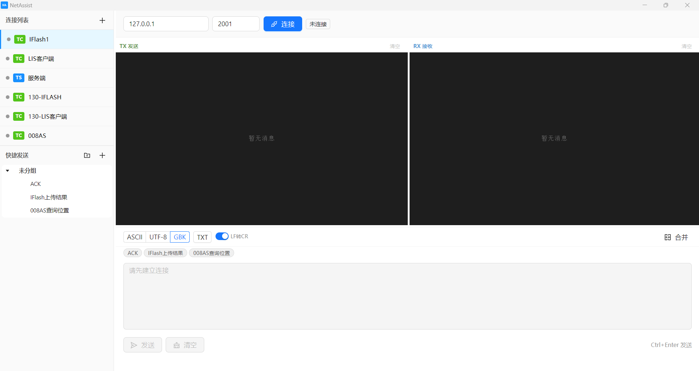

# NetAssist

<p align="center">
  
</p>

<p align="center">
  <strong>跨平台 TCP/UDP 网络调试工具</strong>
</p>

<p align="center">
  
  
  
  
  
</p>

---

## 简介

NetAssist 是一款基于 Electron 构建的跨平台网络调试工具，支持 TCP Client、TCP Server 和 UDP 三种通信模式。界面简洁直观，提供多标签页管理、多编码支持、HEX 查看、快捷发送等实用功能，是嵌入式开发、物联网调试、网络协议测试的得力助手。

## 功能特性

- **多协议支持** — TCP Client、TCP Server、UDP，三种模式应对不同调试场景
- **多标签页** — 同时管理多个连接，标签页配置自动持久化
- **多编码支持** — UTF-8、ASCII、GBK 编码自由切换，适配中文设备与嵌入式终端
- **HEX 模式** — 支持 HEX 格式收发与实时格式化预览，方便二进制协议调试
- **快捷发送** — 可分组、可拖拽排序的快捷指令树，一键发送常用数据
- **TCP Server 多客户端** — 同时接入多个客户端，支持单播/广播切换
- **发送历史** — 按 ↑↓ 键回溯已发送内容
- **实时统计** — TX/RX 字节计数、传输速率、连接时长一目了然
- **LF→CR 转换** — 一键将换行符 `\n` 转换为回车符 `\r`，适配各类串口/网络协议
- **分屏视图** — 发送区与接收区支持分开/合并显示
- **跨平台** — Windows、macOS、Linux 全平台支持

## 界面预览



## 快速开始

### 环境要求

- [Node.js](https://nodejs.org/) >= 18
- [pnpm](https://pnpm.io/) >= 8

### 安装与运行

```bash
# 克隆仓库
git clone https://github.com/your-org/net-assist.git
cd net-assist

# 安装依赖
pnpm install

# 启动开发模式
pnpm dev

# 构建生产版本
pnpm build
```

### 打包分发

```bash
# Windows
pnpm build:win

# macOS
pnpm build:mac

# Linux
pnpm build:linux
```

构建产物位于 `dist/` 目录。

## 技术栈

| 层级 | 技术 |
|------|------|
| 桌面框架 | [Electron](https://www.electronjs.org/) 28 |
| 前端框架 | [React](https://react.dev/) 18 + [TypeScript](https://www.typescriptlang.org/) |
| UI 组件库 | [Ant Design](https://ant.design/) 5 |
| 状态管理 | [Zustand](https://github.com/pmndrs/zustand) |
| 构建工具 | [electron-vite](https://electron-vite.org/) + [Vite](https://vitejs.dev/) |
| GBK 编码 | [iconv-lite](https://github.com/ashtuchkin/iconv-lite) |
| 持久化 | [electron-store](https://github.com/sindresorhus/electron-store) |
| 测试 | [Vitest](https://vitest.dev/) + [Testing Library](https://testing-library.com/) |
| 包管理 | [pnpm](https://pnpm.io/) |
| 分发 | [electron-builder](https://www.electron.build/) |

## 项目结构

```
net-assist/
├── src/
│   ├── main/                    # 主进程 (Node.js)
│   │   ├── connections/         # 连接管理 (TCP Client/Server, UDP)
│   │   ├── encoding/            # 编码处理 (GBK codec)
│   │   ├── ipc/                 # IPC 路由注册
│   │   ├── store/               # 数据持久化 (electron-store)
│   │   └── index.ts             # 主进程入口
│   ├── preload/                 # 预加载脚本 (context bridge)
│   │   └── index.ts
│   ├── renderer/                # 渲染进程 (React)
│   │   ├── index.html
│   │   └── src/
│   │       ├── components/      # UI 组件
│   │       │   ├── common/      # 通用组件 (ASCII 高亮)
│   │       │   ├── config/      # 连接配置面板
│   │       │   ├── encoding/    # 编码选择器 & HEX 编辑器
│   │       │   ├── layout/      # 主布局
│   │       │   ├── messages/    # 消息列表
│   │       │   ├── quick-send/  # 快捷发送面板
│   │       │   ├── send/        # 发送面板
│   │       │   ├── stats/       # 统计栏
│   │       │   └── tab/         # 标签页
│   │       ├── hooks/           # IPC 通信 Hook
│   │       ├── store/           # Zustand 状态管理
│   │       ├── App.tsx
│   │       └── main.tsx
│   └── shared/                  # 共享类型与 IPC 通道定义
│       ├── types.ts
│       └── ipc-channels.ts
├── resources/                   # 应用图标
├── docs/                        # 文档
├── electron.vite.config.ts      # electron-vite 配置
├── package.json
└── tsconfig*.json
```

## 开发

```bash
# 运行测试
pnpm test

# 监听模式
pnpm test:watch

# 代码检查与格式化
# (根据项目配置使用 eslint / prettier)
```

## 使用指南

### 创建连接

点击左侧「+」按钮，选择 TCP Client、TCP Server 或 UDP，即可新建连接标签页。

### TCP Client

1. 输入目标主机 IP 地址与端口号
2. 点击「连接」建立 TCP 连接
3. 在发送区输入数据，选择编码格式，点击「发送」

### TCP Server

1. 输入监听端口号，点击「连接」启动服务
2. 客户端连接后显示在连接列表中
3. 可切换目标客户端进行单播，或使用广播模式向所有客户端发送

### UDP

1. 配置本地绑定端口与目标主机/端口
2. 点击「连接」开始 UDP 通信
3. 支持双向收发

### 快捷发送

- 点击左侧快捷发送面板的「+」新增指令
- 支持创建分组进行归类管理
- 拖拽指令可调整分组归属
- 点击指令旁的发送按钮一键发送
- 指令数据持久化保存

### 编码与显示

- 顶部工具栏可切换编码格式：UTF-8 / ASCII / GBK
- 「TXT」/「HEX」按钮切换文本模式与十六进制模式
- HEX 模式下可在发送区直接输入 HEX 数据（如 `AA BB CC 0D 0A`）
- 「LF→CR」开关自动将发送内容中的 `\n` 替换为 `\r`

### 键盘快捷键

| 快捷键 | 功能 |
|--------|------|
| `Ctrl + Enter` | 发送消息 |
| `↑` / `↓` | 在发送历史中前后导航 |
| 双击标签页标题 | 重命名标签页 |

## License

[MIT](LICENSE)
